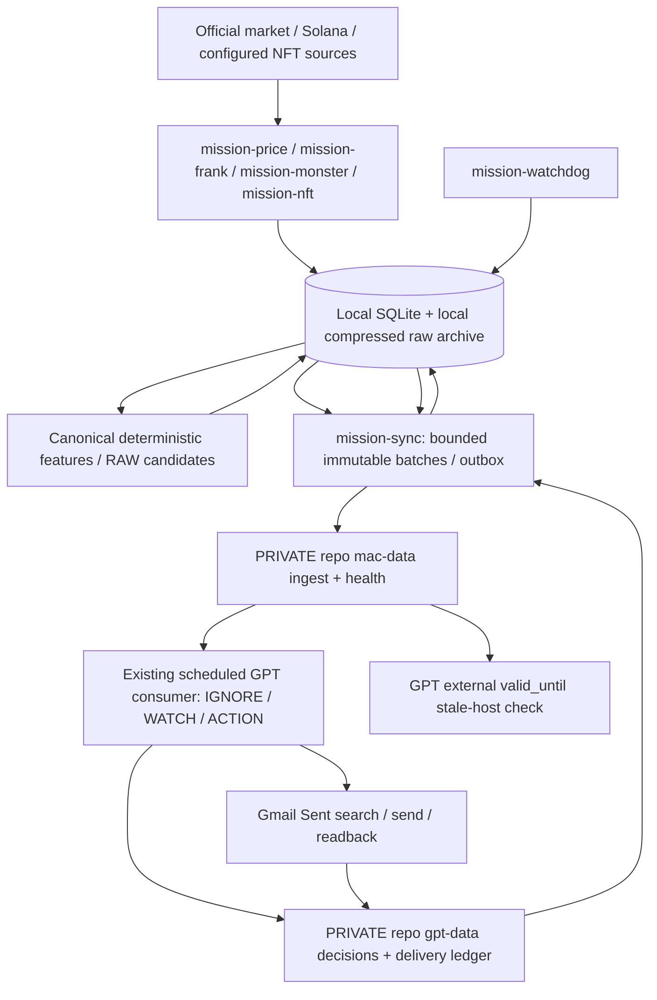

# Crypto Opportunity Monitor — Technical design

Version: design-v1, 2026-09-30 Asia/Bangkok. Proposed architecture; no production collector implemented. Authority and blockers: PRODUCT_REQUIREMENTS.md. Audit results: CAPABILITY_AUDIT.md.

## Topology and process ownership

Collectors are independent asyncio processes with source-specific rate limits and bounded memory. mission-frank live and separate opt-in mission-frank-history share parser but distinct cursors/queue class; historical transport cannot consume live slots. mission-sync alone publishes Mac transport and reconciles receipts. mission-watchdog only measures/restarts infrastructure with circuit breaker. All local DB mutations use short transactions; process ownership is not a DB durability mechanism. Future packaged Python 3.11+ runtime with pinned lockfile/pytest/WebSocket dependency is required; system 3.14 and bundled 3.12 were inspected, dependencies currently absent. No background process launched now.

## launchd and host lifecycle

LaunchAgent runs in user login session, can use login Keychain, and recovers after verified login/bootstrap; it does not guarantee execution before login. LaunchDaemon starts in system domain with explicit low-privilege service user and separate credential/access design; it cannot assume access to user's unlocked login Keychain. FileVault locked boot volume/preboot authentication can prevent unattended recovery even with LaunchDaemon. Deployment choice awaits OPEN_PRODUCT_DECISION 3.

Future plist templates include absolute executable/config paths, WorkingDirectory outside public Git, RunAtLoad, KeepAlive with throttle, separate logs and resource limits. Install/uninstall/status scripts are future reviewed artifacts. No installation or pmset mutation now. Reboot/login/FileVault/clamshell/sleep/wake/power-loss tests are manual controlled gates. Current pmset reports sleep=0, standby/hibernate enabled; this is a snapshot, not proof that closed-lid or reboot collection survives. On sleep/wake detect UTC-vs-monotonic gap, reconnect, backfill eligible gaps and recompute freshness. Power-off stops watchdog too; external stale-host detection is mandatory. No “automatic after every reboot” claim until tests pass.

## Local storage schema (proposed migration 001)

Private runtime root: configurable path default ~/Library/Application Support/CryptoMission; permissions 0700, DB/raw/log files 0600. Outside public checkout. UTC timestamps RFC3339 with microsecond precision; integer source milliseconds and slot preserved separately. Foreign keys enabled.

| Table | Keys and minimum columns / constraints |
|---|---|
| meta | key PK, value_json; install_id, schema_version, release, health_seq |
| source_cursor | (source, lane) PK; cursor_json, finalized_slot, last_contiguous_signature, updated_at; no shared history/live cursor |
| raw_event | (source, source_key) PK; observed_at, received_at, raw_sha256, compressed_blob or local_archive_path, byte_count, fetch_status, error_code; FETCHED/UNAVAILABLE_ON_PUBLIC_RPC/RETRY_PENDING |
| candidate | event_id TEXT PK, event_type, source, asset, observed_at, created_at, schema_version, payload_json, payload_sha256, priority, status, sync_status, synced_at, gpt_decision, gpt_decision_at, delivery_status, updated_at; type allows RAW_* only on collector insertion |
| sync_outbox | outbox_id PK, event_id FK, batch_id, target_branch, attempt_count, next_attempt_at, state, remote_sha, last_error; UNIQUE(event_id,batch_id) |
| batch | batch_id PK, canonical_manifest_json, payload_sha256, item_count, generated_at, valid_until, bytes, state; immutable content |
| batch_item | (batch_id,event_id) PK, ordinal UNIQUE per batch, payload_sha256; FK batch/candidate |
| gpt_decision | (event_id,decision_version) PK, batch_id, input_payload_sha256, item_payload_sha256, decision, decision_at, consumer_version, receipt_sha, validation_status |
| delivery | event_id PK/FK, state, policy nullable, attempt_id, fence, lease_owner, lease_expiry, provider_message_id nullable, last_sent_lookup_at, uncertain_since, readback_at, updated_at |
| health_sample | (host_boot_id,seq) PK, generated_at, valid_until, payload_json; seq monotonically increases per persistent install |
| source_status | source PK, class, status, last_success_at, coverage_from, coverage_to, gap_json |
| migration_history | version PK, script_sha256, applied_at, release, result |
| canonical_bar | (market,asset,interval,window_end) PK, OHLCV decimal strings, completed, source_version, data_quality |

candidate status separates PENDING_DECISION/DECIDED_* from sync state and delivery state. Terminal stale/rejected/quarantined items have explicit reasons and remain auditable. No disappearing item on validation failure. Immutable event payload conflict with same id/different hash is quarantined, not overwritten. Re-evaluation uses decision_version linked to original id; material new event has deterministic new version, never GPT-invented id.

Migration strategy: numbered, checksum-bound migrations; startup rejects unknown/newer schema, backs up before migration, BEGIN IMMEDIATE, checks invariants then commits schema/version/history together. Failure rolls back. Additive expand/contract preferred; destructive retention migration requires separately reviewed policy. Release rollback supported only to schema-compatible previous version; otherwise restore known backup and explicitly reconcile post-backup events. Never silently downgrade a DB.

WAL + synchronous=FULL + busy_timeout=5s; short BEGIN IMMEDIATE writer transactions; no network I/O in DB transaction. Raw ledger, evidence/candidate, outbox and cursor contiguous advancement commit atomically. Cursor cannot cross unresolved fetch/parser/archive failure. Explicit unavailable fetch may be accounted but cannot make complete-history gate PASS. Reader snapshots do not block writer; bounded WAL checkpoint when idle, record lag. Crash recovery uses SQLite committed state, not file modification times.

Backups: daily SQLite online backup API into private directory, hash + integrity_check, include archive manifest, last 7 daily/4 weekly (proposed defaults; fit total budget). Periodic isolated restore test checks row/hash/cursor/outbox counts. Never plain-copy a live WAL DB. Target RPO <=24h backup against disk failure; process crash RPO=0 committed records. Proposed RTO <=30min validated later. Pending events/unreconciled receipts never garbage-collected. Market bars default 45d; Monster compact snapshots 7d, Frank gzip raw 30d after verified evidence and backups, local redacted logs 7d; replay manifest pins required input. Retention is configurable and final disk decision can require shorter archive or larger budget without discarding unresolved data. When budget cannot preserve required evidence stop backfill first, expose blocker; no unauthorized historical deletion.

## Deterministic contracts and hashing

Namespace and identity use canonical asset/market identifiers; event_id escaped components with fixed version/time format:
- price:<asset-market>:<price_rule_version>:<UTC-window_end>:<rule_id>
- frank:<signature> (single fixed configured wallet); history/live share identity and dedup, distinct lane bookkeeping.
- monster:<canonical-symbol>:<candidate_version>:<UTC-window_end>
- nft:<canonical-source>:<object_id>:<event_type>:<source-change-version>

Each repeated real event gives same id. NFT change-version is canonical content hash, not fetch timestamp. Price repeated-rule samples remain separate deterministic observations; GPT suppresses unchanged thesis/action with delivery/event linkage, without silently dropping raw events.

Canonical JSON profile MISSION_JSON_V1: UTF-8, Unicode NFC strings, lexicographic normalized keys, no whitespace, no NaN/Infinity, duplicate keys rejected; integer counters, exact decimal strings (no binary float fields), arrays retain defined ordinal order. Normalize before size/hash validation; reject normalization key collision. SHA-256 lowercase hex. Python/consumer independent known vectors required. Item payload_sha256 = hash canonical evidence payload (exclude envelope hash/volatile sync fields). Batch payload_sha256 = hash canonical {schema_version,batch_id,generated_at,valid_until,item_count,items}; exclude only envelope payload_sha256. Each item carries event_id/envelope/payload/item hash, stable ordinal. batch_id = install namespace + persisted monotonic batch sequence, never reused; immutable byte content across retry. Hash includes metadata to prevent changed TTL/count/id from passing. Reference vectors become PHASE 1 fixtures, not this round's code.

Candidate envelope: schema_version, event_id, event_type RAW_*, source, market/asset, observed_at, created_at, rule/candidate_version, data_quality, priority factual severity, evidence payload + payload_sha256. Bounds include complete envelope <=2,000 UTF-8 bytes. Oversized required evidence -> explicit split factual evidence parts with parent id/part manifest or quarantine; never silently truncate authority/token fields. External excerpt can be capped at 240 characters, marked untrusted_external_text with canonical URL/content hash/source metadata. Raw transactions/HTML/social bodies forbidden in batch. External commands/instructions are inert data and cannot change consumer tools/rules/recipients.

Batch envelope: schema_version, batch_id, generated_at, valid_until (transport freshness, proposed 2h), item_count, payload_sha256, items. <=100,000 UTF-8 bytes, normal <=40; urgent additionally included within bytes and a proposed max 8/cycle. At least oldest normal slots prevent starvation; urgent overflow stays in explicit priority backlog. Batch size measured after canonical serialization. Immutable pages runtime-v2/ingest/batches/<batch_id>.json plus current-batch.json pointer/complete current envelope; no unacknowledged batch overwritten/deleted. Current contains oldest ready page; consumer missed-cycle recovery enumerates a bounded manifest until caught up. Stale batch expires freshness for judgement, not durability: explicit stale disposition/refresh request, no pretend fresh event. Refresh immutable new batch metadata includes original event identity; pending reconciliation retained.

GPT decision receipt: schema_version, input_batch_id, input_payload_sha256, consumed_item_count, decision_count, decision_timestamp, consumer_version, decisions[event_id,item_payload_sha256,decision,decision_version,reason/evidence]. Exactly one disposition per item including stale/rejected; count==batch item_count==unique decision ids. IGNORE/WATCH/ACTIONABLE_RISK/ACTIONABLE_OPPORTUNITY only for final decision. Independent deterministic reconciler reads receipt bytes, validates exact set/hashes/version/time, rejects omissions/extras/duplicates/mismatch. Sync status does not mean consumed. Receipt source blob SHA and batch linkage persist transactionally before local completion.

## Private GitHub transport and concurrency

MISSION_RUNTIME_REPO unset -> LOCAL_ONLY/DRY_RUN. Config alone is insufficient: authenticated repository metadata must affirm private=true and authorized writer identity. Public, inaccessible, visibility changed or metadata unavailable -> fail closed before runtime write. Recheck each sync session, cache no permissive indefinite answer. Credentials minimum-scope private runtime repo; code repo credential separate. Never force push.

mac-data: Mac-only runtime-v2/ingest/** and health/current.json. gpt-data: GPT-only decisions/**, delivery/**, consumer-lock/**. No two roles mutate same path; immutable receipt archive retained under bounded retention after reconciled backup. health every 10–15min or change (debounced); candidates event-driven coalesced into bounded commits, immutable pending pages; no raw per-tick/minute commits. Outbox retries exact bytes with expected parent/blob SHA. GitHub 409 refetch/check hash then CAS retry; no blind overwrite. API 429/secondary limit honor Retry-After, primary reset headers, exponential full jitter 1s..300s; persist next attempt. GitHub downtime retains local queues; old transport snapshot expires. Publish receipts event-driven, no per-item commit requirement. Writes/day measured, proposed cap 200/day with backlog alarm (not silently drop).

Consumer fencing is a PHASE 2 blocker: read decision + delivery ledger, acquire persisted gpt-data lease via expected blob/branch SHA compare-and-swap before judging/sending, fresh random attempt_id and monotonically increasing fence. Loser does no send. Lease must cover provider timeout plus uncertainty reconciliation; do NOT auto-steal expired DELIVERY_SENDING lease for a resend. Expired sending converts to DELIVERY_UNCERTAIN. Revalidate ownership immediately before send; external mail has no transactional fence, so no strict exactly-once claim. If scheduled connector cannot perform conditional writes, durable readback or separate branch access, integration is NO_GO until reviewed transport alternative; prompt text alone cannot implement atomic locks. Mac locally mirrors delivery, but remote send lease is authoritative for remote coordination; SQLite remains sole local truth.

## Gmail delivery protocol

State machine:
PENDING_DECISION -> DECIDED_IGNORE / DECIDED_WATCH / DELIVERY_PENDING.
DELIVERY_PENDING -> fenced DELIVERY_SENDING intent persisted BEFORE provider call.
Send success -> persist provider message id immediately in private remote delivery ledger; Mac imports to SQLite; readback with SENT label, exact token and expected recipient -> DELIVERED.
Timeout, crash in sending, persistence failure, search lag/readback failure -> DELIVERY_UNCERTAIN; uncertain restart only reconciles Sent, never blind resend.
DELIVERY_UNCERTAIN -> DELIVERED on positive verified match, or FAILED_MANUAL_REVIEW after policy-specific horizon. Policy unset means dry run only. AT_MOST_ONCE never automatically retries ambiguous send. AT_LEAST_ONCE may permit a reviewed delayed retry after negative reconciliation horizon; owner must set horizon and accept rare duplicates. Neither policy changes unconditional no-blind-resend rule.

Subject/body includes literal [MISSION:<event_id>] unchanged; Sent search first for pending/uncertain, then exact-token validation on readback (search results alone are not exact-match proof). Search success with zero matches is different from failed search. Negative search immediately after send is not proof of absence. Poll cooldown proposal 1/5/15/60min; persist attempts and uncertainty age, no mails for infrastructure diagnostics. Message id in private ledger only. Send action exists in tool inventory but was not invoked; canary requires explicit user authorization later. Real canary: >=3 distinct ids, same-id replay >=3, provider actual count, ambiguity/receipt fail/Sent delay.

## Source semantics

Price: C[t] is completed 1m close; return_h=100*(C[t]/C[t-h]-1). Prior high/low exclude current bar; breakout level anchored before first sample and both consecutive closes beyond same level. reversal_15m = max(100*(H15-C)/H15,100*(C-L15)/L15) with H15/L15 computed from prior 15 completed bars plus current completed close; upward/downward components recorded separately. RV5 = sqrt(sum of five squared 1m log returns); rolling baseline median of 1,440 prior RV5 values excludes current. Exact thresholds decimal arithmetic; boundary units percentage points. BTC-relative compares aligned completed windows, gaps -> unavailable, no fill-forward across missing bars. Need >=24h+5m warm-up; replay 30 full days after warm-up. Live/replay call same feature/rule module. Every bar source timestamp/market tracked, provisional ineligible. Stream feeds updated bars; close flags/interval-end determine canonical completion; late corrections do not mutate already-issued evidence, emit versioned correction record.

Objective missed-move criterion frozen before replay: every chronological 15m anchor whose next 60 completed 1m closes reach absolute >=5% excursion is a positive episode, overlapping qualifying anchors grouped into maximal consecutive episodes; recall if eligible price candidate occurs between episode first anchor and first qualifying excursion, with full warm-up. Future data used only to label evaluation, never feature inputs. Noise proxy: emitted candidate with next 60m absolute maximum excursion <1% and no new rule hit; descriptive, not profit/false-investment label. Report per-asset trigger count/day median,p95,max, rule counts/overlap, noise samples, objective misses and source gaps. No hindsight threshold fitting.

Binance spot CORE endpoints distinct from USD-M Monster. Official current futures regular market stream uses /market; no copying pre-migration URLs. Audit verified spot aggTrade and futures /market/ws/btcusdt@kline_1m first JSON frames only. Implement heartbeat/pong and source-specific documented limits; scheduled make-before-break before 24h expiry where allowed, verify subscription/snapshot, dedup overlap by source key/event time, close old; simulated + real >=24h continuity test. Disconnect recovery persists gap, REST backfill completed bars, resubscribe, bounded jitter; never silently claim continuous coverage.

Hyperliquid candleSnapshot retains recent 5,000 candles: 43,200 1m for 30d impossible by that API alone. Forward accumulation >=31d or approved validated history required. Use allMids as lightweight quote plus HYPE candle subscription; heartbeat/reconnect/snapshot/backfill with explicit unavailable gaps; mid freshness doesn't prove candle history.

Frank PHASE 4 manifest freezes exact 7,106 signatures/window and provenance before age-rank probe. Sort ascending age, ranks newest,25%,50%,oldest, preserve request/response hashes privately. All probes finalized/maxSupportedTransactionVersion=1. Null/history-unavailable -> UNAVAILABLE_ON_PUBLIC_RPC; oldest missing -> FULL_HISTORY_NOT_FEASIBLE_WITH_PUBLIC_RPC_ONLY. 429/timeouts retry bounded, don't infer pruning. Then consecutive 500 requested: each FETCHED or explicit unavailable; fetched archive/evidence 100%, cursor gap=0, consistency PASS; >=50 seeded random manual samples compare raw RPC + independent explorer presentation. Unavailable item accounted does not count as fully validated fetched history. Unsupported transaction version/parser ambiguity blocks contiguous advance; fee-adjusted SOL movements/WSOL and owner-vs-authority facts kept distinct. Raw gzip hash of uncompressed bytes, archive-write/fsync before DB reference commit; orphan recovery manifest checks.

Monster actual availability probe records available_since, retention_days, delisted_supported for OI/funding/top-trader/taker. Audit has NOT_RUN, not fictional results. D1 full denominator includes delisted unavailable inventory, D2 forward features, D3 sufficient observations before model gate. Preserve original first_seen/setup facts and oldest deferred fairness; no retroactive setup invention. NFT per-source success denominator expected scheduled required attempts; empty output valid only after successful configured-source observation; upstream outage marks gap.

## Health, time, logging and resource budget

overall in HEALTHY/DEGRADED/UNHEALTHY/UNKNOWN; missing or stale input UNKNOWN locally, externally expired host => overall UNHEALTHY with reason UNHEALTHY_STALE_HOST. seq,generated_at,valid_until,host_boot_id,collector_version,clock_offset_ms,sqlite_writable,disk_free_bytes,network_status,github_sync_lag_sec,unsynced_events,price_assets_live,price_max_age_sec,frank_rpc_last_success_age_sec,frank_cursor_gap,monster_universe_age_sec,nft_required_source_success_ratio,gpt_pending_events,oldest_pending_age_sec,last_e2e_canary,last_e2e_canary_at,restart_count_24h,sleep_gap_detected are mandatory. Missing configured required-source measurements cannot default HEALTHY; absent optional source still explicit gap. Proposed health TTL=20min for 10–15min publish; external GPT only checks hourly, so stale detection itself can lag nearly a cycle. seq regression/replayed boot snapshot rejected; clock jumps quarantine time-dependent rules. UTC internal, Bangkok display, monotonic local latency; cross-host wall-clock uncertainty reported, not subtracted as exact latency.

Watchdog samples local process/freshness/DB/network/disk/queue every 30s; repeated crash >=3/10min circuit breaker with health; rate-limited restarts, no killing unrelated processes. It cannot resolve external semantics or silence stale gaps. NTP/time offset unavailable -> UNKNOWN, never fabricate zero. Logs JSON structured, secret redact, no credentials/whole external bodies/wallet activity in public repo; private metrics log ids/hashes. Public report aggregate sanitized only.

Aggregate collector/sync/watchdog CPU/RSS sampling every 10s >=60min normal and stress workload, plus 48h shadow; CPU normalize to one logical core, RSS sum, network bytes/day, SQLite+WAL/raw/backups/log sizes, events/day, GitHub writes/day. No collector exists in PHASE 0: host shell snapshot is not a resource PASS. Default storage soft budget 2GB; >80% DEGRADED_DISK, >95% UNHEALTHY_DISK. Reserve capacity for queues; cap backfill/concurrency/memory; never evict unresolved events. If capacity arrival > service indefinitely, no finite queue can meet SLO: alarm and explicit sizing/throughput review.

## Failure matrix, rollback and deployment

| Failure | Durable response | Recovery / evidence |
|---|---|---|
| network/429/timeout | retain cursor/outbox, source gap, jitter retry | catch-up no lost ids |
| public RPC null old tx | explicit unavailable ledger | full-history NOT_FEASIBLE if oldest required missing |
| WS disconnect/24h/sleep | gap, reconnect, REST eligible backfill | exact overlapping dedup/bar continuity |
| GitHub 409/rate limit/down | CAS/idempotent retry; local truth retained | remote hashes/receipt reconciliation |
| SQLite lock/full/corrupt | bounded retry or stop writes; health unavailable | isolated restore, no primary destructive test |
| bad JSON/hash/duplicate id conflict | quarantine with reason, no consume ack | corrected version explicitly linked |
| missed consumer/backlog | retain immutable pages, degraded/unhealthy queue | later exact-set receipt recovery |
| concurrent send/crash/ambiguous | persisted lease/intent -> uncertain | Sent-only reconciliation, owner policy |
| host power-off | external expired TTL overrides last HEALTHY | verified login/start and catch-up |
| source noncoverage | explicit UNKNOWN/gap | no fabricated NO_ACTION |

Deployment PHASE 10 requires all acceptance gates, owner decisions, locked dependency runtime, private visibility/access test, secrets Keychain permission, signed off launch mode and rollback rehearsal. Default DRY_RUN, Gmail disabled; no launchd install in this phase. Versioned release directories + config/schema compatibility check; stop new ingestion gracefully, drain/retain outbox, switch executable, resume at durable cursor, compare metrics. Rollback last compatible binary; DB restore only explicit reviewed recovery with post-backup replay. Production enable and automation prompt changes require later explicit owner action; neither a commit nor design review activates them.

## Primary documentation checked 2026-09-30

- [Binance futures migration](https://developers.binance.com/en/docs/products/derivatives-trading-usds-futures/websocket-market-streams/Important-WebSocket-Change-Notice): regular streams routed /market; implementation must recheck current docs.
- [Binance spot streams](https://developers.binance.com/en/docs/catalog/core-trading-spot-trading/api/ws-streams/~): spot endpoint separate.
- [Hyperliquid info endpoint](https://hyperliquid.gitbook.io/hyperliquid-docs/for-developers/api/info-endpoint): latest 5,000 candles; replay constraint.
- [Solana getTransaction](https://solana.com/docs/rpc/http/gettransaction): transaction/version/commitment contract.

## HYPE availability evidence refinement

The read-only 31-day 1m probe returned 5,220 rows / 3.624 days, while official documentation states most recent5,000. Treat retention as approximately this scale, not an exact enforced row maximum. This real response does not supply 30 days and does not pass the replay gate; complete historical retrieval remains blocked under the current endpoint contract.
